# AgriBridge-AI Platform: System Architecture & Operational Manual

**Platform Version:** 1.0.0 Enterprise  
**Generated Date:** September 8, 2026  
**Document Classification:** Comprehensive System Manual & Architectural Specification  

---

## Table of Contents
1. [Executive Summary & Core Platform Vision](#1-executive-summary--core-platform-vision)
2. [Technology Stack & System Architecture](#2-technology-stack--system-architecture)
3. [Role-Based Access Control (RBAC) Matrix](#3-role-based-access-control-rbac-matrix)
4. [Data Storage & Persistence Architecture ("Where Is It Stored?")](#4-data-storage--persistence-architecture-where-is-it-stored)
5. [Complete Page-by-Page Manual with Visual Screenshots](#5-complete-page-by-page-manual-with-visual-screenshots)
   - 5.1 [Public Authentication Suite](#51-public-authentication-suite)
     - [01. Standard Login Page (`/login`)](#01-standard-login-page-login)
     - [02. 1-Click Demo Sandbox (`/demo/login`)](#02-1-click-demo-sandbox-demologin)
     - [03. Password Recovery (`/forgot-password`)](#03-password-recovery-forgot-password)
   - 5.2 [Platform Hub & Overview](#52-platform-hub--overview)
     - [04. Unified Platform Dashboard Hub (`/dashboard`)](#04-unified-platform-dashboard-hub-dashboard)
   - 5.3 [Agronomy & Farm Operations Suite](#53-agronomy--farm-operations-suite)
     - [05. Farms & Plots Management (`/farms`)](#05-farms--plots-management-farms)
     - [06. Crop Lifecycle & Harvest Tracking (`/crops`)](#06-crop-lifecycle--harvest-tracking-crops)
     - [07. Field Tasks & Operations (`/tasks`)](#07-field-tasks--operations-tasks)
     - [08. Cost Basis & Cultivation Expenses (`/expenses`)](#08-cost-basis--cultivation-expenses-expenses)
     - [09. Inventory & Consumables Stock (`/inventory`)](#09-inventory--consumables-stock-inventory)
   - 5.4 [Commerce, Mandi & Fulfillment Suite](#54-commerce-mandi--fulfillment-suite)
     - [10. Produce Marketplace — Direct Farmgate Sale (`/marketplace`)](#10-produce-marketplace--direct-farmgate-sale-marketplace)
     - [11. Mandi Slot Booking & Yard Auctions (`/mandi`)](#11-mandi-slot-booking--yard-auctions-mandi)
     - [12. Orders & Logistics Tracking (`/orders`)](#12-orders--logistics-tracking-orders)
     - [13. Profit Reports Engine (`/profit-reports`)](#13-profit-reports-engine-profit-reports)
   - 5.5 [Maker-Checker Governance Suite](#55-maker-checker-governance-suite)
     - [14. Request New User & Role (`/admin-maker/create-request`)](#14-request-new-user--role-admin-maker-create-request)
     - [15. My Role Requests Tracker (`/admin-maker/requests`)](#15-my-role-requests-tracker-admin-maker-requests)
   - 5.6 [Admin Governance & Master Tables Suite](#56-admin-governance--master-tables-suite)
     - [16. User Management & Admin Approval Queue (`/admin/users`)](#16-user-management--admin-approval-queue-adminusers)
     - [17. Produce Marketplace Moderation (`/admin/moderation`)](#17-produce-marketplace-moderation-adminmoderation)
     - [18. Disputes & Mediation Center (`/admin/disputes`)](#18-disputes--mediation-center-admindisputes)
     - [19. Security Compliance Audit Logs (`/admin/audit-logs`)](#19-security-compliance-audit-logs-adminaudit-logs)
6. [Auditability & Compliance Mechanisms](#6-auditability--compliance-mechanisms)

---

## 1. Executive Summary & Core Platform Vision

**AgriBridge-AI** is a comprehensive agricultural intelligence, farm operations, and dual-channel commerce platform engineered for Indian agrarian ecosystems. 

### Core Problems Solved:
1. **Disconnected Farm Economics:** Farmers traditionally harvest crops without visibility into cumulative cost-basis (seed, water, fertilizer, labor, machinery costs per acre). AgriBridge-AI provides a real-time **Cost Basis Engine** calculating true cultivation cost per kilogram.
2. **Dual-Channel Market Access:** Farmers can evaluate **Direct Farmgate Sales to Bulk Buyers** (FOB, farmgate pickup, prompt payment) versus **APMC Mandi Yard Auctions** (commission, transport deductions, daily benchmark prices) through a 3-way profit comparison engine before committing produce.
3. **Enterprise Governance & Security:** Prevents rogue account creation using a strict **Maker-Checker paradigm** where `Admin Maker` proposes accounts, but only `Admin` can provision active platform credentials. All security events are written to an append-only audit trail.

---

## 2. Technology Stack & System Architecture

```
┌────────────────────────────────────────────────────────────────────────┐
│                          AgriBridge-AI Client                          │
│          React 18 + Vite + TypeScript + TailwindCSS + Redux Toolkit    │
└───────────────────────────────────┬────────────────────────────────────┘
                                    │ HTTP / REST & JWT Bearer
                                    ▼
┌────────────────────────────────────────────────────────────────────────┐
│                        Express.js API Backend                          │
│               TypeScript + Modular Phase 1 Route Architecture          │
└───────────────────┬────────────────────────────────┬───────────────────┘
                    │                                │
                    ▼                                ▼
┌──────────────────────────────────────┐   ┌─────────────────────────────┐
│    Phase 1 In-Memory Engine          │   │    PostgreSQL / Supabase    │
│  - Real-time Cost-Basis Calculator   │   │  - Persistent DB Storage    │
│  - Instant Session Seed Store        │   │  - Row-Level Security       │
│  - Automated Audit Logger            │   │  - Relational Integrity     │
└──────────────────────────────────────┘   └─────────────────────────────┘
```

- **Frontend Core:** React 18, TypeScript, Vite 5, Redux Toolkit, TailwindCSS, custom UI components (`EnterpriseDataTable`, `EnterpriseCheckbox`, `BulkUploadModal`).
- **Backend Core:** Node.js v24, Express, TypeScript, Crypto (SHA-256 password hashing & tokens), CSV export engines.
- **Data Persistence:** Dual-layer hybrid architecture:
  1. *Primary Cloud Store:* Supabase PostgreSQL relational database.
  2. *Resilient In-Memory State Engine:* Instant seed initialization, offline resilience, and dynamic recalculation of farm financials.

---

## 3. Role-Based Access Control (RBAC) Matrix

AgriBridge-AI enforces strict role separation across 7 distinct platform roles:

| Module / Page Route | Farmer | Farm Manager | Worker | Buyer | Mandi Agent | Admin Maker | Admin / SuperAdmin |
| :--- | :---: | :---: | :---: | :---: | :---: | :---: | :---: |
| **Farmer Dashboard Hub** (`/dashboard`) | ✅ | ✅ | ✅ | ✅ | ✅ | ❌ | ❌ |
| **Admin Governance Console** (`/dashboard`) | ❌ | ❌ | ❌ | ❌ | ❌ | ❌ | ✅ |
| **Farms & Plots** (`/farms`) | ✅ | ✅ | ❌ | ❌ | ❌ | ❌ | ❌ |
| **Crop Lifecycle** (`/crops`) | ✅ | ✅ | ❌ | ❌ | ❌ | ❌ | ❌ |
| **Field Tasks** (`/tasks`) | ✅ | ✅ | ✅ | ❌ | ❌ | ❌ | ❌ |
| **Cost Basis & Expenses** (`/expenses`)| ✅ | ✅ | ❌ | ❌ | ❌ | ❌ | ❌ |
| **Consumables Inventory** (`/inventory`)| ✅ | ✅ | ❌ | ❌ | ❌ | ❌ | ❌ |
| **Produce Marketplace** (`/marketplace`)| ✅ | ❌ | ❌ | ✅ | ❌ | ❌ | ❌ |
| **Mandi Slot Booking** (`/mandi`) | ✅ | ❌ | ❌ | ❌ | ✅ | ❌ | ❌ |
| **Orders & Logistics** (`/orders`) | ✅ | ❌ | ❌ | ✅ | ❌ | ❌ | ❌ |
| **Profit Reports** (`/profit-reports`) | ✅ | ❌ | ❌ | ❌ | ❌ | ❌ | ❌ |
| **Request Role** (`/admin-maker/create-request`)| ❌ | ❌ | ❌ | ❌ | ❌ | ✅ | ❌ |
| **Requests Tracker** (`/admin-maker/requests`)| ❌ | ❌ | ❌ | ❌ | ❌ | ✅ | ❌ |
| **User Management** (`/admin/users`) | ❌ | ❌ | ❌ | ❌ | ❌ | ❌ | ✅ |
| **Direct User Provisioning** (`/admin/create-user`)| ❌ | ❌ | ❌ | ❌ | ❌ | ❌ | ✅ |
| **Produce Moderation** (`/admin/moderation`)| ❌ | ❌ | ❌ | ❌ | ❌ | ❌ | ✅ |
| **Disputes Center** (`/admin/disputes`)| ❌ | ❌ | ❌ | ❌ | ❌ | ❌ | ✅ |
| **Audit Logs** (`/admin/audit-logs`) | ❌ | ❌ | ❌ | ❌ | ❌ | ❌ | ✅ |

---

## 4. Data Storage & Persistence Architecture ("Where Is It Stored?")

### 4.1 Client-Side Browser Storage (`localStorage`)
- `token`: JWT Bearer authentication token issued upon login.
- `user`: JSON serialized user profile (`id`, `email`, `firstName`, `lastName`, `roles`, `tenantId`, `status`).
- `tenantId`: Tenant context for multi-tenant isolation.
- `agribridge_logo_choice`: User's selected brand theme (`option3`).

### 4.2 Backend Data Store Entities (`server/src/database/phase1Store.ts` & Supabase PostgreSQL)

| Domain Area | Entity / Table Name | Primary Keys & References | What Data Is Stored |
| :--- | :--- | :--- | :--- |
| **Users & Security** | `users` | `id` (PK) | Email, SHA-256 password hash, roles array, account status (`active`, `suspended`), timestamp. |
| **Maker-Checker** | `user_requests` | `id` (PK), `requestedBy` | Requested email, role, maker source, verification status (`PENDING_APPROVAL`, `APPROVED`, `REJECTED`), reviewer ID. |
| **Land Registry** | `farms` | `id` (PK), `farmerId` (FK) | Farm name, location, total acreage, soil type, water source, ownership type (`Owned`/`Leased`). |
| **Plot Parcels** | `plots` | `id` (PK), `farmId` (FK) | Plot name, acreage, micro-soil type, irrigation method (Drip, Canal, Sprinklers), notes. |
| **Agronomy** | `crop_cycles` | `id` (PK), `plotId` (FK), `farmId` (FK) | Crop variety, season, sowing date, stage (`SOWING`, `VEGETATIVE`, `FLOWERING`, `HARVEST`), harvest yield (kg). |
| **Field Work** | `tasks` | `id` (PK), `cropCycleId` (FK), `assignedTo` | Task type, instructions, due date, priority, status (`PENDING`, `IN_PROGRESS`, `COMPLETED`). |
| **Cost Basis** | `expenses` | `id` (PK), `cropCycleId` (FK), `plotId` (FK) | Expense category (`SEEDS`, `FERTILIZER`, `LABOR`, `IRRIGATION`), cost in INR, date, invoice ref. |
| **Inventory** | `inventory_items` | `id` (PK), `farmId` (FK) | Consumable item, category, current stock quantity, unit (`kg`, `liters`, `bags`), reorder alert threshold. |
| **Marketplace** | `produce_listings` | `id` (PK), `cropCycleId` (FK), `farmerId` | Produce name, grade (`A`/`B`/`C`), quantity available, asking price per kg, pickup location, status. |
| **Offers & Bids** | `offers` | `id` (PK), `listingId` (FK), `buyerId` (FK) | Offer price per kg, quantity requested, counter-offer price, negotiation status (`PENDING`, `ACCEPTED`, `REJECTED`). |
| **Mandi Operations**| `mandi_slots` | `id` (PK), `farmerId` (FK), `mandiId` | Booking slot token, arrival date, vehicle number, expected quantity, auction status, final modal price. |
| **Fulfillment** | `orders` | `id` (PK), `listingId` (FK), `buyerId` (FK) | Order total value, escrow payment status, dispatch date, carrier details, delivery status (`DELIVERED`). |
| **Arbitration** | `disputes` | `id` (PK), `orderId` (FK), `raisedBy` | Dispute reason (quality deficit, weight variance, delayed transit), evidence, admin resolution note. |
| **Compliance** | `audit_logs` | `id` (PK), `actorId` | Immutable security log: timestamp, action (`APPROVE_USER`, `SUSPEND_ACCOUNT`, `FLAG_LISTING`), details. |

---

## 5. Complete Page-by-Page Manual with Visual Screenshots

---

### 5.1 Public Authentication Suite

#### 01. Standard Login Page (`/login`)
- **Authorized Roles:** Public / All registered users
- **Route:** `http://localhost:3000/login`
- **What It Does:** Secure authentication portal supporting email and password login. Features direct password toggling, role validation, and redirects to `/dashboard` upon successful JWT issuance.


- **Storage Location:** Evaluated against `users` table via `POST /api/v1/auth/login`. Sets `token` and `user` in `localStorage` upon success.

---

#### 02. 1-Click Demo Sandbox (`/demo/login`)
- **Authorized Roles:** Public / Reviewers & Evaluators
- **Route:** `http://localhost:3000/demo/login`
- **What It Does:** Instant zero-friction evaluation portal. Allows clicking on any of the 7 pre-seeded platform roles (`Admin`, `Admin Maker`, `Farmer`, `Farm Manager`, `Worker`, `Buyer`, `Mandi Agent`) with prefilled credentials to inspect role-specific UI and capabilities immediately.

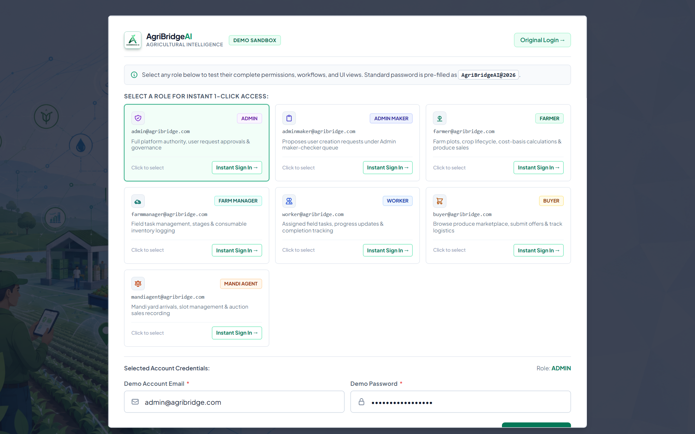

- **Storage Location:** Authenticates against seeded accounts in `phase1Store.users`.

---

#### 03. Password Recovery (`/forgot-password`)
- **Authorized Roles:** Public
- **Route:** `http://localhost:3000/forgot-password`
- **What It Does:** Self-service password recovery flow. Users enter their registered email address to receive an OTP or secure reset link.


- **Storage Location:** Dispatches OTP generation request to `POST /api/v1/auth/forgot-password`.

---

### 5.2 Platform Hub & Overview

#### 04. Unified Platform Dashboard Hub (`/dashboard`)
- **Authorized Roles:** `FARMER`, `FARM_MANAGER`, `WORKER`, `BUYER`, `MANDI_AGENT`, `ADMIN`, `ADMIN_MAKER`
- **Route:** `http://localhost:3000/dashboard`
- **What It Does:** Central command center displaying live weather warnings, active farm overview, quick actions, today's field tasks, dual-channel pricing benchmarks, and recent transactions.

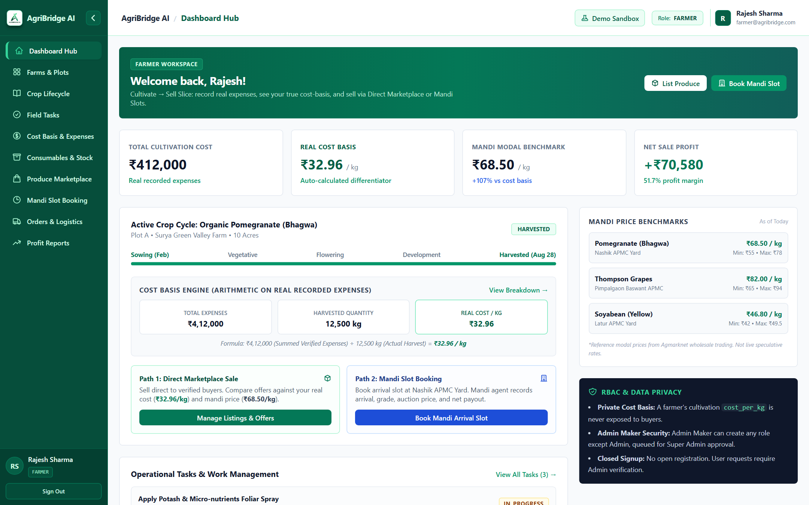

- **Storage Location:** Aggregates live data from `farms`, `tasks`, `crop_cycles`, `mandi_prices`, and OpenWeather API.

---

### 5.3 Agronomy & Farm Operations Suite

#### 05. Farms & Plots Management (`/farms`)
- **Authorized Roles:** `FARMER`, `FARM_MANAGER`, `ADMIN`, `SuperAdmin`
- **Route:** `http://localhost:3000/farms`
- **What It Does:** Master land parcel registry. Left side lists all registered farm holdings with total acreage, soil type, and plot count. Right side breaks down each farm into **Cultivable Plots** (area in acres, soil type: Black Loamy / Red Sandy, irrigation source: Borewell, Drip, Canal). Every crop cycle, task, and cultivation expense traces directly back to a specific Plot.

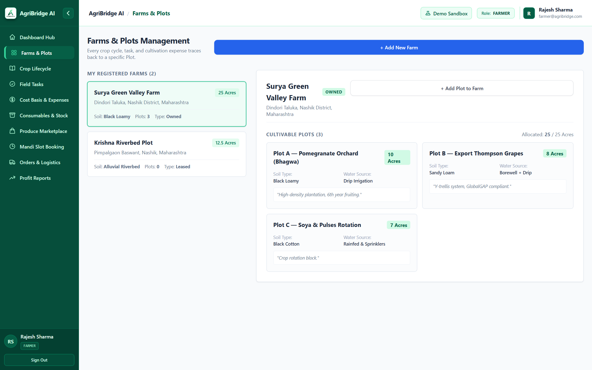

- **Storage Location:** Stored in `farms` and `plots` tables via `GET /api/v1/farms` and `POST /api/v1/farms/{farmId}/plots`.

---

#### 06. Crop Lifecycle & Harvest Tracking (`/crops`)
- **Authorized Roles:** `FARMER`, `FARM_MANAGER`, `ADMIN`, `SuperAdmin`
- **Route:** `http://localhost:3000/crops`
- **What It Does:** Tracks crop progression across growth stages: *Sowing -> Germination -> Vegetative -> Flowering -> Fruit Development -> Harvest*. Records harvest yield, quality grade, and feeds production data into cost-per-kg calculations.

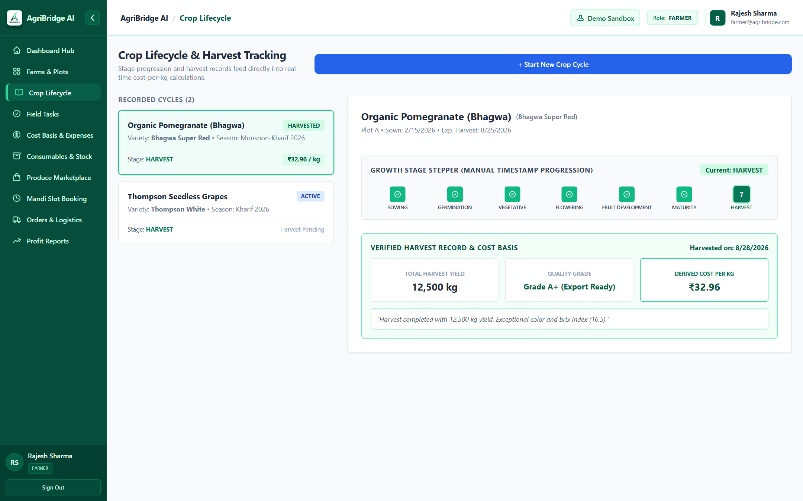

- **Storage Location:** Stored in `crop_cycles` table via `GET /api/v1/crop-cycles` and `POST /api/v1/crop-cycles`.

---

#### 07. Field Tasks & Operations (`/tasks`)
- **Authorized Roles:** `FARMER`, `FARM_MANAGER`, `WORKER`, `ADMIN`, `SuperAdmin`
- **Route:** `http://localhost:3000/tasks`
- **What It Does:** Operational field work management. Farm Managers and Farmers create, prioritize, and assign daily agronomic tasks (irrigation, spraying, fertilizing, weeding, harvesting) to Workers with real-time status updates.

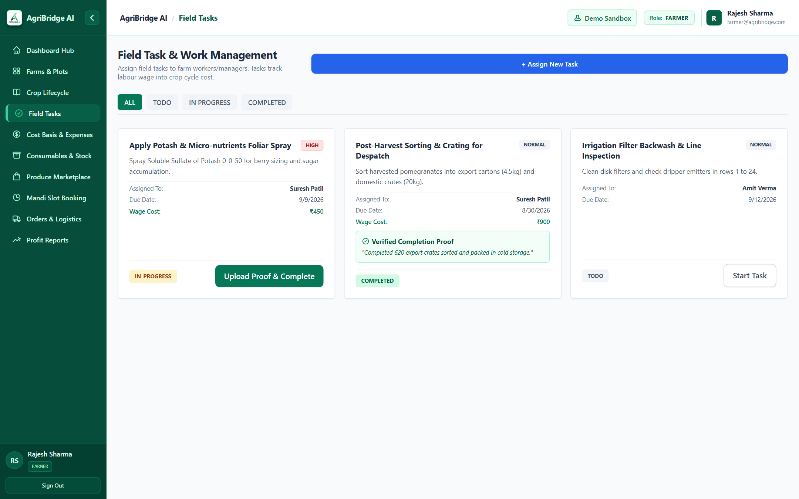

- **Storage Location:** Stored in `tasks` table via `GET /api/v1/tasks` and `PATCH /api/v1/tasks/{id}/status`.

---

#### 08. Cost Basis & Cultivation Expenses (`/expenses`)
- **Authorized Roles:** `FARMER`, `FARM_MANAGER`, `ADMIN`, `SuperAdmin`
- **Route:** `http://localhost:3000/expenses`
- **What It Does:** Dynamic financial cost-basis calculator. Tracks every rupee spent on seeds, fertilizers, chemical sprays, irrigation power, labor wages, and machinery. Automatically aggregates total cultivation expenditure and divides it by expected/actual yield to calculate the farmer's **True Break-Even Cost per Kg**.

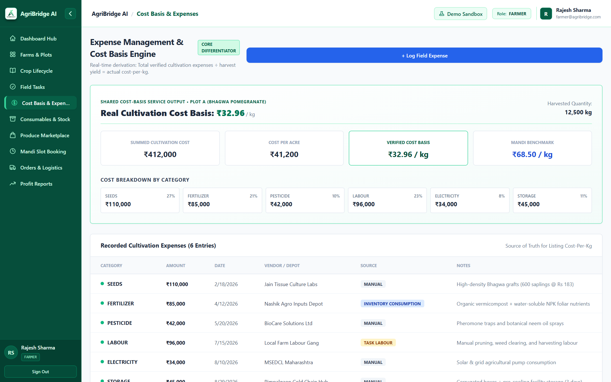

- **Storage Location:** Stored in `expenses` table via `POST /api/v1/expenses` and computed dynamically via `phase1Store.calculateCropCost(cycleId)`.

---

#### 09. Inventory & Consumables Stock (`/inventory`)
- **Authorized Roles:** `FARM_MANAGER`, `FARMER`, `ADMIN`, `SuperAdmin`
- **Route:** `http://localhost:3000/inventory`
- **What It Does:** Consumable stock management for agricultural inputs (seeds, bio-fertilizers, pesticides, fuel, drip filters). Tracks quantities on hand, unit costs, and triggers low-stock warnings when inventory falls below minimum safety thresholds.

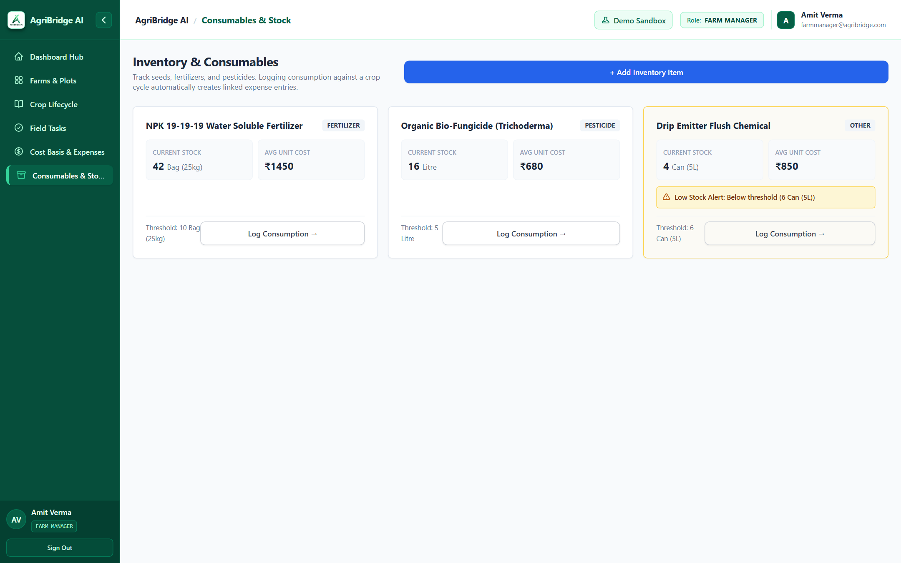

- **Storage Location:** Stored in `inventory_items` table via `GET /api/v1/inventory` and `POST /api/v1/inventory`.

---

### 5.4 Commerce, Mandi & Fulfillment Suite

#### 10. Produce Marketplace — Direct Farmgate Sale (`/marketplace`)
- **Authorized Roles:** `FARMER`, `BUYER`, `ADMIN`, `SuperAdmin`
- **Route:** `http://localhost:3000/marketplace`
- **What It Does:** Digital B2B farmgate marketplace. Farmers publish harvested lots with quality grades and asking prices. Buyers submit purchase offers. Features an integrated **3-Way Profit Comparison Engine** that compares farmgate offer value against Mandi benchmarks and farmer cost-basis.

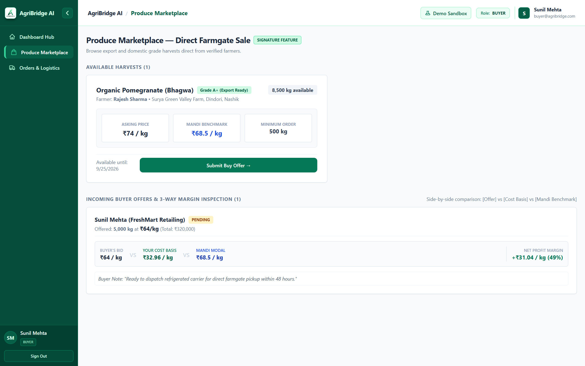

- **Storage Location:** Stored in `produce_listings` and `offers` tables via `GET /api/v1/produce/listings` and `POST /api/v1/offers`.

---

#### 11. Mandi Slot Booking & Yard Auctions (`/mandi`)
- **Authorized Roles:** `FARMER`, `MANDI_AGENT`, `ADMIN`, `SuperAdmin`
- **Route:** `http://localhost:3000/mandi`
- **What It Does:** Regulated APMC Mandi slot reservation and auction ledger. Farmers pre-book yard arrival tokens with vehicle details to avoid mandi congestion. Mandi agents record arrivals, auction weights, commission fees, and final realized prices.

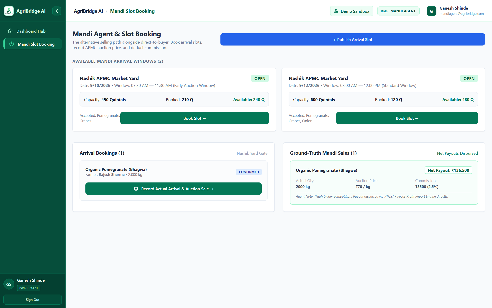

- **Storage Location:** Stored in `mandi_slots` and `mandi_prices` tables via `POST /api/v1/mandi/slots`.

---

#### 12. Orders & Logistics Tracking (`/orders`)
- **Authorized Roles:** `FARMER`, `BUYER`, `ADMIN`, `SuperAdmin`
- **Route:** `http://localhost:3000/orders`
- **What It Does:** End-to-end commercial order fulfillment tracker. Manages order status from confirmation, farmgate collection, transport carrier assignment, delivery verification, to final escrow payout release.

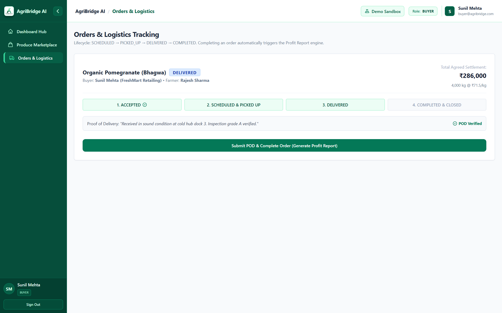

- **Storage Location:** Stored in `orders` table via `GET /api/v1/orders`.

---

#### 13. Profit Reports Engine (`/profit-reports`)
- **Authorized Roles:** `FARMER`, `ADMIN`, `SuperAdmin`
- **Route:** `http://localhost:3000/profit-reports`
- **What It Does:** Financial analytics and net profit report generator. Correlates gross harvest revenue from both Marketplace and Mandi sales against cumulative cost-basis to display net profit margins per plot and per crop variety.

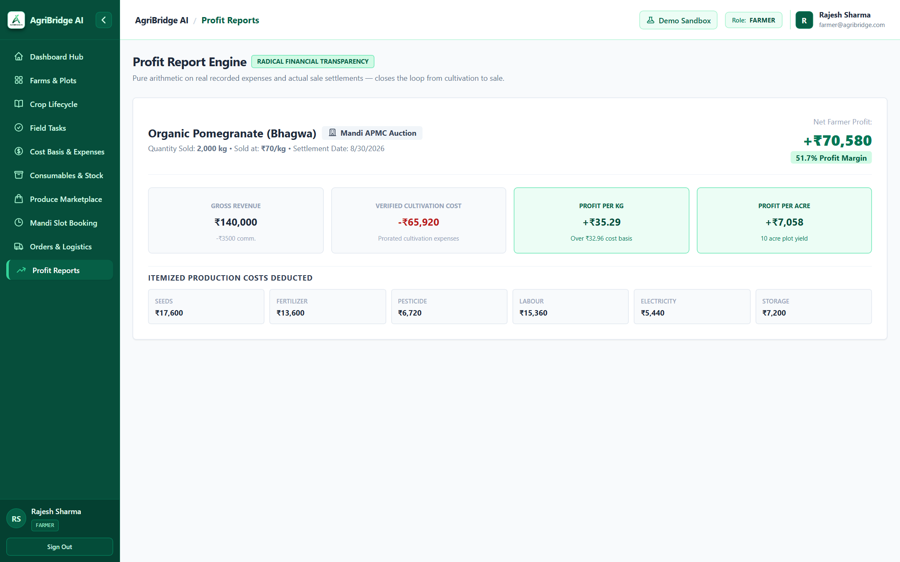

- **Storage Location:** Computed dynamically via `phase1Store.generateProfitReport(farmerId)`.

---

### 5.5 Maker-Checker Governance Suite

#### 14. Request New User & Role (`/admin-maker/create-request`)
- **Authorized Roles:** `ADMIN_MAKER`, `ADMIN`, `SuperAdmin`
- **Route:** `http://localhost:3000/admin-maker/create-request`
- **What It Does:** Maker input portal. Admin Makers fill out candidate user applications (name, email, phone, requested role, and verification dossier notes) to submit them into the Admin review queue. Self-registration of elevated roles is restricted.

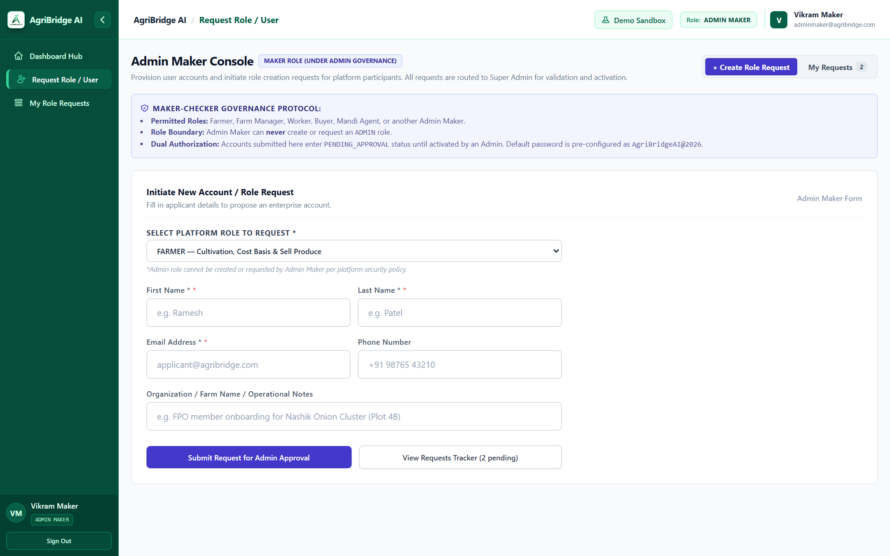

- **Storage Location:** Stored in `user_requests` with status `PENDING_APPROVAL` via `POST /api/v1/auth/request-role`.

---

#### 15. My Role Requests Tracker (`/admin-maker/requests`)
- **Authorized Roles:** `ADMIN_MAKER`, `ADMIN`, `SuperAdmin`
- **Route:** `http://localhost:3000/admin-maker/requests`
- **What It Does:** Real-time tracker for Admin Makers to audit the status of all proposed user requests (Pending Admin Review, Approved, or Rejected with reason).

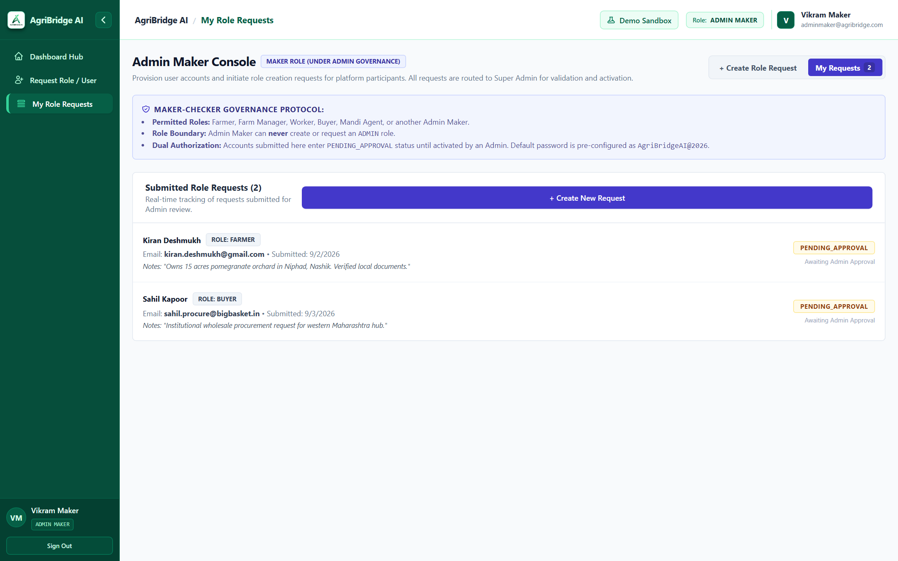

- **Storage Location:** Queried from `user_requests` where `requestedBy === authUser.email`.

---

### 5.6 Admin Governance & Master Tables Suite

#### 16. User Management & Admin Approval Queue (`/admin/users`)
- **Authorized Roles:** `ADMIN`, `SuperAdmin`
- **Route:** `http://localhost:3000/admin/users`
- **What It Does:** High-density enterprise master data table. Admins approve or reject maker-submitted requests, directly create instant active accounts across all roles, execute batch CSV bulk imports, toggle account suspension, and export user directories to Excel/CSV. Includes custom indeterminate "Select All" checkbox support.

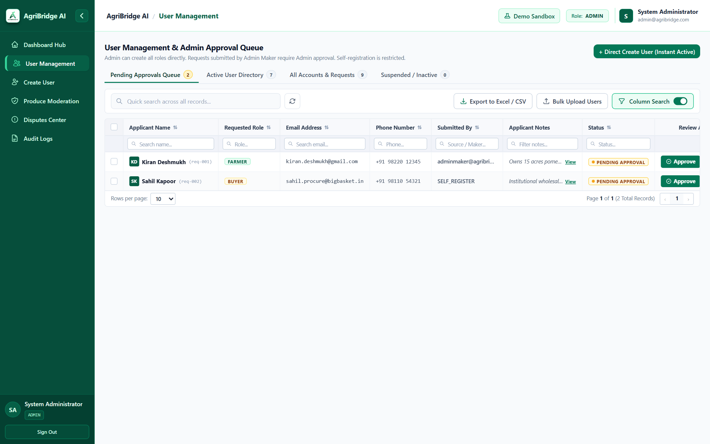

- **Storage Location:** Queries and updates `user_requests` and `users` tables via `POST /api/v1/auth/user-requests/{id}/approve` and `POST /api/v1/auth/admin/bulk-create-users`.

---

#### 17. Produce Marketplace Moderation (`/admin/moderation`)
- **Authorized Roles:** `ADMIN`, `SuperAdmin`
- **Route:** `http://localhost:3000/admin/moderation`
- **What It Does:** Quality compliance and market integrity oversight. Admins audit produce listings against Mandi benchmark prices and remove or flag fraudulent lots, poor grade representations, or speculative pricing.

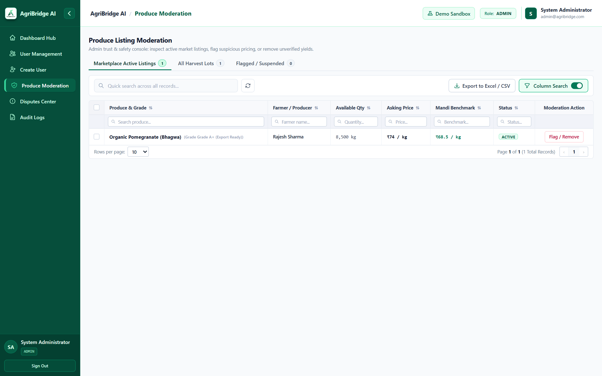

- **Storage Location:** Updates `produce_listings` status to `FLAGGED` or `REMOVED` via `POST /api/v1/admin/listings/{id}/moderate`.

---

#### 18. Disputes & Mediation Center (`/admin/disputes`)
- **Authorized Roles:** `ADMIN`, `SuperAdmin`
- **Route:** `http://localhost:3000/admin/disputes`
- **What It Does:** Commercial arbitration queue. Mediates conflicts between Farmers and Buyers regarding produce quality defects, transit delays, weight discrepancies, or payment adjustments.

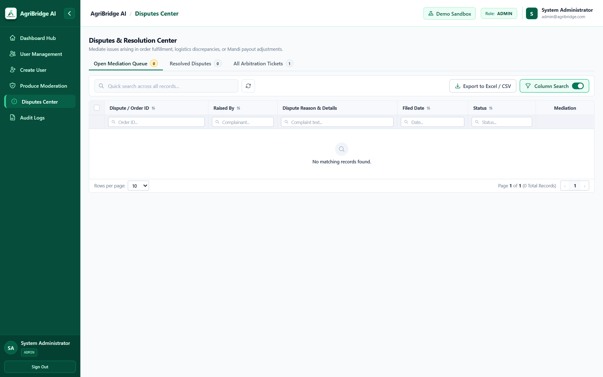

- **Storage Location:** Stored in `disputes` table via `GET /api/v1/admin/disputes` and `POST /api/v1/admin/disputes/{id}/resolve`.

---

#### 19. Security Compliance Audit Logs (`/admin/audit-logs`)
- **Authorized Roles:** `ADMIN`, `SuperAdmin`
- **Route:** `http://localhost:3000/admin/audit-logs`
- **What It Does:** Immutable compliance log. Records every security-sensitive action taken across the platform: role requests, approvals, account suspensions, listing removals, and arbitration settlements with actor emails, entity IDs, and timestamps.

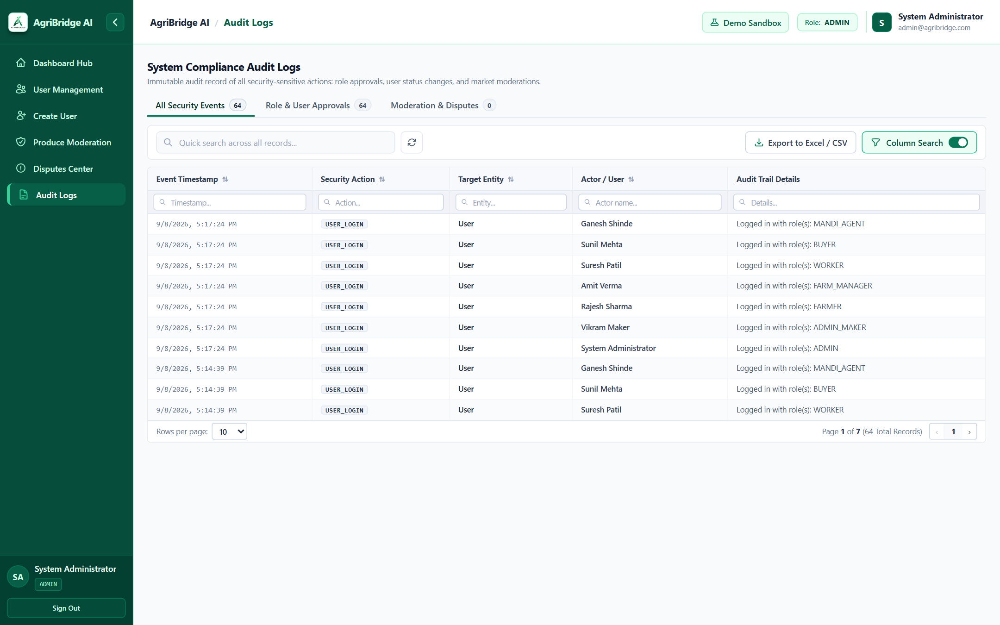

- **Storage Location:** Stored in append-only `audit_logs` table via `GET /api/v1/admin/audit-logs`.

---

## 6. Auditability & Compliance Mechanisms

1. **Maker-Checker Segregation:** No single user can create an active account with elevated privileges. Admin Maker proposes; Admin authorizes.
2. **Immutable Audit Trail:** All approval, moderation, and dispute decisions write an entry to `audit_logs` before responding to API requests.
3. **Data Protection & Privacy:** Farmer cost-basis calculations remain private to the farmer and are never exposed to external buyers on the marketplace.
4. **Resilient Export Support:** All enterprise master tables feature one-click RFC 4180-compliant CSV exports formatted with UTF-8 BOM encoding for seamless Microsoft Excel rendering.
