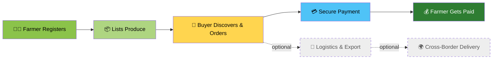
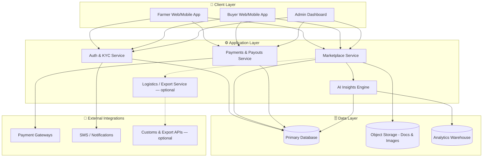

<div align="center">


<a href="https://github.com/your-org/agribridge-ai/stargazers">
  
</a>
<a href="https://github.com/your-org/agribridge-ai/network/members">
  
</a>
<a href="https://github.com/your-org/agribridge-ai/issues">
  
</a>
<a href="https://github.com/your-org/agribridge-ai/blob/main/LICENSE">
  
</a>

<br/>


<br/>


</div>

<br/>

## 🌾 About AgriBridge

> **AgriBridge is, at its core, an agriculture platform** — not an export tool.
> Farmers **register**, **list produce**, **sell**, and **get paid** through AgriBridge every single day, whether or not a single batch ever crosses a border.

Cross-border trade, logistics, and export documentation are **optional extensions** on top of a platform that already works for the local, everyday farmer-to-buyer transaction. Domestic-only usage is a first-class use case, not an afterthought.

<br/>

<div align="center">



*The core loop (green/yellow/blue) works fully domestically. Export (grey, dashed) is an optional layer on top.*

</div>

<br/>

## ✨ Key Features

<table>
<tr>
<td width="50%" valign="top">

### 👨‍🌾 For Farmers
- 📝 Simple, low-friction registration & KYC
- 🌱 List crops, produce, and inventory in minutes
- 📊 Real-time market price visibility
- 💸 Fast, transparent, and secure payouts
- 🤖 AI-driven crop & yield insights
- 🏦 Access to credit / micro-loans based on sales history

</td>
<td width="50%" valign="top">

### 🛒 For Buyers & Partners
- 🔍 Discover verified farmers & produce near you
- 🤝 Direct-from-farm sourcing, no middlemen
- 📦 Optional logistics & export documentation
- ✅ Escrow-backed, trust-first payments
- 📈 Bulk ordering & contract farming support
- 🌍 Seamless path from local purchase to global export

</td>
</tr>
</table>

<br/>

<div align="center">

</div>

## 🧭 How It Works

<div align="center">

| Step | What Happens |
|:---:|:---|
| **1️⃣** | Farmer signs up and completes a lightweight profile & verification |
| **2️⃣** | Farmer lists produce — quantity, price, quality, location |
| **3️⃣** | Buyers (local markets, retailers, aggregators, exporters) discover listings |
| **4️⃣** | Order is placed and paid for through AgriBridge's secure payment rail |
| **5️⃣** | Farmer receives payout — instantly or on a scheduled cycle |
| **6️⃣** *(optional)* | If the buyer is cross-border, logistics + export workflows kick in automatically |

</div>

<br/>

## 🏗️ Architecture



<br/>

## 🚀 Tech Stack

> Update this table to match your actual stack — placeholders below keep things flexible.

<div align="center">

| Layer | Technology |
|:--|:--|
| **Frontend** | React / Next.js, TypeScript, TailwindCSS |
| **Backend** | Node.js (Express/NestJS) *or* Django/Python |
| **Database** | PostgreSQL / MongoDB |
| **AI / Insights** | Python, scikit-learn / TensorFlow |
| **Payments** | Stripe / Razorpay / Local payment rails |
| **Infra** | Docker, GitHub Actions CI/CD, AWS/GCP/Azure |
| **Auth** | JWT, OAuth2 |

</div>

<div align="center">


</div>

<br/>

## 📦 Getting Started

### Prerequisites
```bash
node >= 18.x
npm or yarn
PostgreSQL / MongoDB running locally or via Docker
```

### Installation

```bash
# 1. Clone the repository
git clone https://github.com/your-org/agribridge-ai.git
cd agribridge-ai

# 2. Install dependencies
npm install

# 3. Configure environment variables
cp .env.example .env

# 4. Run database migrations (if applicable)
npm run migrate

# 5. Start the development server
npm run dev
```

<div align="center">

Then open **[http://localhost:3000](http://localhost:3000)** 🎉

</div>

<br/>

## 🔑 Environment Variables

| Variable | Description |
|:--|:--|
| `DATABASE_URL` | Connection string for your database |
| `JWT_SECRET` | Secret key for auth tokens |
| `PAYMENT_GATEWAY_KEY` | API key for your payment provider |
| `AI_SERVICE_URL` | Endpoint for the AI insights microservice |
| `LOGISTICS_API_KEY` | *(Optional)* Key for export/logistics partner API |

<br/>

## 🗺️ Roadmap

- [x] Farmer registration & verification
- [x] Marketplace listing & discovery
- [x] Secure payments & payouts
- [x] AI-powered crop & price insights
- [ ] Farmer credit scoring & micro-loans
- [ ] Multi-language support
- [ ] Offline-first mobile app (low-connectivity regions)
- [ ] Optional export/logistics module
- [ ] Public API for third-party integrations

<br/>

## 🤝 Contributing

Contributions make this project better for farmers everywhere. 🌍

```bash
# Fork the repo, then:
git checkout -b feature/your-feature-name
git commit -m "Add: your feature"
git push origin feature/your-feature-name
# Open a Pull Request 🎉
```

Please read `CONTRIBUTING.md` (if available) before submitting major changes.

<br/>

## 📄 License

This project is licensed under the **MIT License** — see the [LICENSE](./LICENSE) file for details.

<br/>

<div align="center">

## 💬 Get in Touch

<a href="mailto:contact@agribridge.ai">
  
</a>
<a href="https://twitter.com/agribridgeai">
  
</a>
<a href="https://linkedin.com">
  
</a>

<br/><br/>

### 🌱 Built for the farmer who logs in every morning, not just the one shipping containers abroad.


</div>
